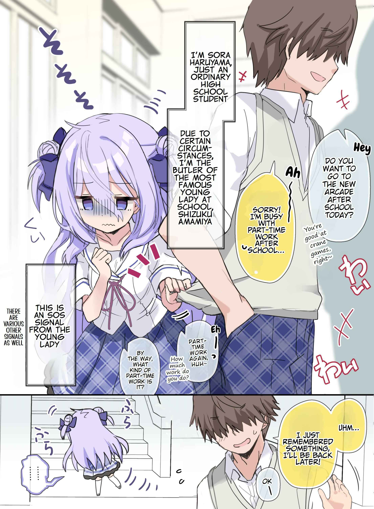
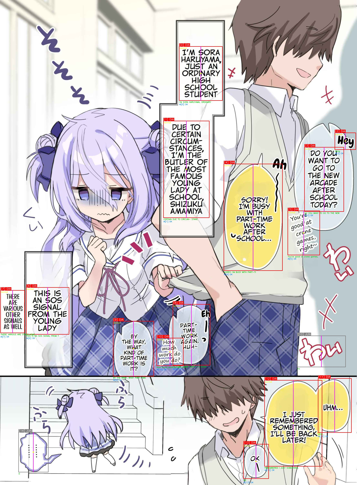
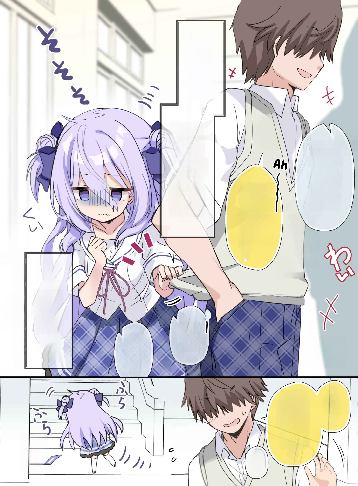
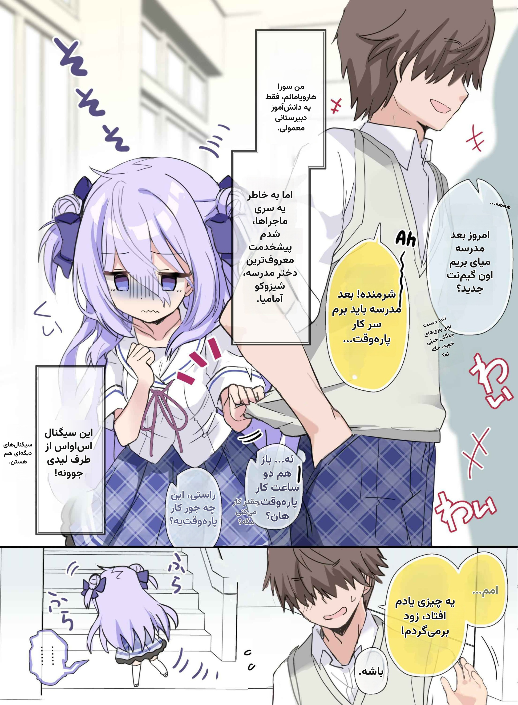

# مترجم خودکار مانگا / مانهوا (فارسی)

[](https://colab.research.google.com/github/amirwolf5122/Manga-AutoTranslate/blob/main/Manga_Translator_Colab.ipynb)
[](https://www.python.org/downloads/)
[](LICENSE)

[DEMO](https://demo--amrie194sm.replit.app/)


ابزاری برای **ترجمه خودکار صفحات مانگا و مانهوا به فارسی**.

متن را با OCR می‌خواند، فقط حروف را از داخل حباب پاک می‌کند، با مدل‌های AI ترجمه می‌کند و متن فارسی را دوباره داخل همان حباب می‌نویسد.

---

## نمونه خروجی


| * | * | * | * |
|:---:|:---:|:---:|:---:|
|  |  |  |  |

---

## فرآیند کار

1. ورودی: پوشه، تصویر، ZIP، PDF یا URL (`*` همه فصل‌ها، `,` چند لینک)
2. صفحات کوتاه چسبانده و بلندها تکه‌تکه می‌شوند
3. تشخیص حباب با RT-DETR (حباب / متن داخل / متن آزاد)
4. OCR با PaddleOCR یا RapidOCR (`en` / `ko` / `ja`)
5. بازسازی فحش‌های سانسورشده
6. ترجمه با مدل انتخابی (چند حباب در هر درخواست)
7. پاکسازی هوشمند متن (فقط حروف — حباب سالم)
8. رندر فارسی با فونت متناسب با لحن
9. خروجی: **PDF / ZIP / HTML / PSD / پوشه تصویر**

---

## ویژگی‌ها

| ویژگی | توضیح |
|---|---|
| تشخیص حباب | RT-DETR-v2 ONNX — تگ چرخیده و نیمه‌شفاف |
| OCR | PaddleOCR / RapidOCR — چندپاسه + تمیزکاری |
| پاکسازی | خودکار: پرکردن مستقیم / LaMa / LaMa-Manga |
| ماسک فقط حروف | آستانه‌گذاری تطبیقی + فیلتر مؤلفه |
| دور دوم جارو | حروف جامانده پاک می‌شوند |
| متن چرخیده | رندر با همان زاویه |
| اندازه فونت | محدود به ارتفاع متن اصلی |
| واترمارک | تشخیص و نادیده گرفتن |
| فیلتر SFX / junk | تبلیغ و افکت صوتی ترجمه نمی‌شود |
| چند ارائه‌دهنده | Gemini, OpenAI, DeepSeek, Groq, xAI, Together, OpenRouter, Ollama |
| Fallback Gemini | زنجیره خودکار مدل‌ها |
| چند کلید API | چرخش خودکار |
| بچ ترجمه | چند حباب + قفل سراسری |
| واژه‌نامه | قفل اسامی + ذخیره خودکار |
| بریف داستان | حفظ لحن شخصیت‌ها |
| رندر فارسی | reshaper + bidi + فونت لحن |
| چندفصل | `*` همه / `,` چند لینک |
| **خروجی** | پوشه / ZIP / PDF / HTML / **PSD لایه‌ای** |
| نام هوشمند | از URL یا مسیر فصل |
| Resume | ادامه از کش |
| Chunk / Stitch | کاهش مصرف API |
| دیباگ | مربع رنگی + خروجی دیباگ |

---

## خروجی PSD

هر صفحه به‌صورت یک لایه جدا در فایل PSD ذخیره می‌شود (با `pytoshop`).

- لایه‌ها مرتب از پایین به بالا
- بوم مشترک با بزرگ‌ترین ابعاد صفحات
- اگر ابعاد > ۳۰۰۰۰px → **PSB**
- در `--debug` فایل `*_debug.psd` هم ساخته می‌شود
- نصب خودکار `pytoshop`

```bash
python manga.py -i input -o chapter.psd --font fonts/Vazirmatn-Bold.ttf --api-key KEY
python manga.py -i "URL" -o .psd --font fonts/Vazirmatn-Bold.ttf --api-key KEY
```

در رابط برنامه هم گزینه **PSD** در قالب خروجی وجود دارد.

---

## برنامه (`manga_app.py` v1.5)

محیط را تشخیص می‌دهد:

| محیط | رفتار |
|---|---|
| ویندوز / لینوکس / مک (دسکتاپ) | پنجره تیره Tkinter — ورودی، ارائه‌دهنده، فونت‌ها، گزینه‌ها، لاگ زنده، تاریخچه، تب سیستم |
| Google Colab | رابط وب تیره + لینک عمومی gradio.live خودکار |
| GitHub Codespaces | رابط وب + لینک عمومی (بدون Port Forwarding) |
| GitHub Actions | رابط وب + لینک عمومی |

- لانچرها: `Manga.bat` / `manga.sh` → **App / Web / CLI / Exit**
- وب: کلید API فقط در نشست کاربر؛ بعد از ترجمه دکمه‌های نمایش و دانلود
- خواننده وب تمام‌صفحه پایدار
- CLI تعاملی: ورودی، ارائه‌دهنده، کلید و قالب (شامل PSD) را می‌پرسد
- گارد: اگر `manga.py` فایل مترجم نباشد پیام واضح می‌دهد

```bash
python manga_app.py              # تشخیص خودکار
python manga_app.py --web        # اجبار وب
python manga_app.py --desktop    # اجبار پنجره برنامه
python manga_app.py --cli        # CLI تعاملی
python manga_app.py -- -i input -o out.psd --font fonts/Vazirmatn-Bold.ttf --api-key KEY --cpu --lama
```

---

## ارائه‌دهنده‌ها

| provider | مدل پیش‌فرض | متغیر محیطی |
|---|---|---|
| gemini | gemini-3.8-flash | GEMINI_API_KEY |
| openai / chatgpt | gpt-4o-mini | OPENAI_API_KEY |
| deepseek | deepseek-chat | DEEPSEEK_API_KEY |
| groq | llama-3.3-70b-versatile | GROQ_API_KEY |
| xai / grok | grok-2-latest | XAI_API_KEY |
| together | meta-llama/Llama-3.3-70B-Instruct-Turbo | TOGETHER_API_KEY |
| openrouter | google/gemini-2.0-flash-001 | OPENROUTER_API_KEY |
| ollama | llama3.2 | — |

---

## پارامترهای مهم

| پارامتر | توضیح | پیش‌فرض |
|---|---|---|
| `-i` / `--input` | ورودی | اجباری |
| `-o` / `--output` | خروجی (`.pdf` / `.zip` / `.html` / **`.psd`** / پوشه) | اجباری |
| `--font` | فونت فارسی | اجباری |
| `--provider` | ارائه‌دهنده | gemini |
| `--api-key` | کلید API | یا env |
| `--model` | مدل | پیش‌فرض provider |
| `--ocr-lang` | زبان OCR | en |
| `--gpu` / `--cpu` | سخت‌افزار | خودکار |
| `--lama` | اجبار LaMa-Manga | خودکار |
| `--bubbles-per-request` | حباب در هر درخواست | 6 |
| `--batch-workers` | بسته موازی | 3 |
| `--det-confidence` | آستانه تشخیص | 0.16 |
| `--glossary` | واژه‌نامه | — |
| `--no-brief` | خاموش بریف | — |
| `--no-resume` | شروع دوباره | — |
| `--img-format` | webp / png / jpg | jpg |
| `--quality` | کیفیت ۱–۱۰۰ | 90 |
| `--max-width` | سقف عرض | 0 |
| `--debug` | دیباگ | — |

فونت‌های لحن: `--font-normal` · `--font-shout` · `--font-comedy-shout` · `--font-whisper` · `--font-thought` · `--font-system` · `--font-letter` · `--font-narrator` · `--font-free` و ...

با `-o .psd` نام فایل از URL ساخته می‌شود.

---

## پاکسازی متن

| شرایط | روش |
|---|---|
| پس‌زمینه تخت | پرکردن مستقیم |
| پس‌زمینه ساده | LaMa سریع |
| آرت / تیره | LaMa-Manga |

ماسک فقط حروف + دور دوم جارو.

---

## چهار روش اجرا

### ۱) Google Colab (پیشنهادی)

[](https://colab.research.google.com/github/amirwolf5122/Manga-AutoTranslate/blob/main/Manga_Translator_Colab.ipynb)

```bash
!bash manga.sh
```

لینک عمومی `gradio.live` خودکار چاپ می‌شود. ⚠ هر دو فایل `manga.py` (مترجم) و `manga_app.py` (برنامه) باید کنار هم باشند.

### ۲) GitHub Codespaces

```bash
bash manga.sh
```

لینک عمومی خودکار می‌دهد؛ یا تب Ports → پورت 7860 → Public. برای زنده‌ماندن سرور بعد از بستن ترمینال از tmux استفاده کنید:

```bash
tmux new -s manga 'python3 manga_app.py --web'
# detach: Ctrl+B بعد D | بازگشت: tmux attach -t manga
```

### ۳) GitHub Actions

ریپو را Fork کن.  
در Settings → Secrets and variables → Actions کلید را بگذار:  
`GEMINI` / `OPENAI` / `DEEPSEEK` / `GROQ` / `XAI` / `OPENROUTER` / `TOGETHER`  
یا یک Secret عمومی به نام `API`.

از تب Actions یکی از دو ورک‌فلو را Run کن:

- **Manga Web (موقت)** — رابط وب با لینک gradio.live در لاگ؛ بعد از زمان تعیین‌شده خاموش می‌شود؛ خروجی را قبل از خاموش شدن از UI دانلود کن
- **Manga CLI (ترجمه یک‌باره)** — لینک فصل را وارد کن؛ بعد از اتمام، خروجی را از Artifacts دانلود کن

Runnerهای GitHub معمولاً GPU ندارند؛ اجرا روی CPU است و برای batch/CLI مناسب‌تر است. وب فقط موقت است و لینک دائمی نمی‌دهد.

### ۴) اجرای لوکال

```bash
git clone https://github.com/amirwolf512k/Manga-AutoTranslate.git
cd Manga-AutoTranslate

Manga.bat    # ویندوز — منو: App / Web / CLI
./manga.sh   # لینوکس / مک
```

یا مستقیم:

```bash
python manga_app.py          # تشخیص خودکار (دسکتاپ یا وب)
python manga_app.py --cli    # CLI تعاملی
python manga_app.py -- -i "https://...chapter-1/" -o out.psd --font fonts/Vazirmatn-Bold.ttf --api-key KEY --cpu
```

---

## محدودیت‌ها

- تایتل‌های خیلی بزرگ با هاله نورانی که با نقاشی قاطی شده‌اند ممکن است کاملاً پاک نشوند.
- روی CPU کم‌هسته، اینپینت LaMa-Manga برای هر خوشه چند ثانیه طول می‌کشد.
- کیفیت ترجمه به مدل و OCR بستگی دارد؛ متن خیلی استایل‌شده گاهی ناقص خوانده می‌شود.
- SFXهای هنری ممکن است دیده نشوند؛ چون ترجمه نمی‌شوند معمولاً مشکلی نیست.
- واترمارک‌های نصفه‌کاره گاهی به‌اشتباه دیالوگ تشخیص داده می‌شوند.
- بعضی مدل‌های OpenAI-compatible ممکن است JSON را دقیق رعایت نکنند؛ با `--max-retries` بیشتر امتحان کنید.

---

## واژه‌نامه

```
Sung Jinwoo=سونگ جینوو
Cha Hae-In=چا هه این
```

یا `glossary.json` — اسامی قفل و برای فصل بعد ذخیره می‌شوند.

---

## حمایت مالی

ヾ(•ω•`)o

**TON:** `UQBScvayaxagwTfRBhlLNaqw-sZuadlnBjSvn8OJz7XZJJzT`

**TRX:** `TMmLTaCjaW1L2xWZmpR2EBeNyCawCzEkwa`

---

## لایسنس

MIT — آزاد برای استفاده شخصی و غیرتجاری.

حقوق مانگا/مانهوا متعلق به ناشر و خالق اثر است؛ این ابزار فقط برای مطالعه شخصی است.

**توسعه‌دهنده:** [amirwolf5122](https://github.com/amirwolf5122)  
**تلگرام:** [@Amir_wolf512](https://t.me/Amir_wolf512)
